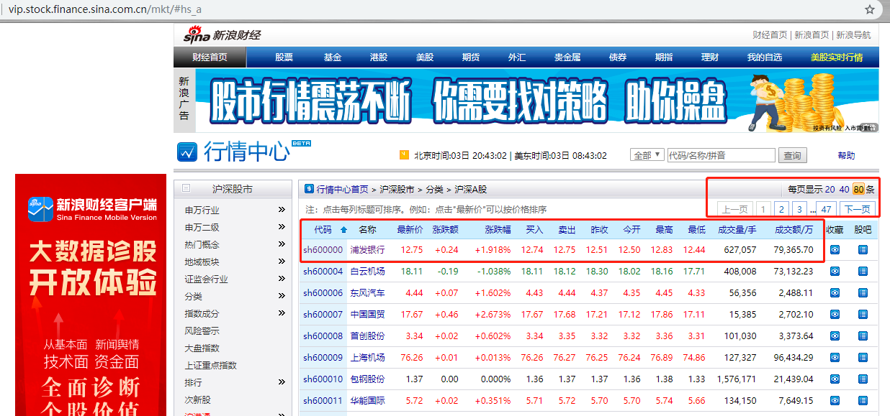
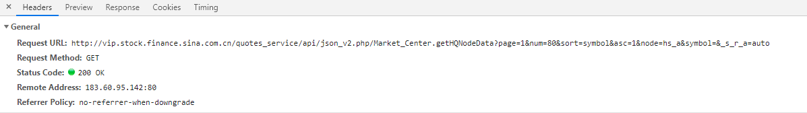

# 依据涨停 进行选股

## 更新

- 2019/10/25  

  本地手动运行成功  

- 2019/10/26  

  双休日同样可以运行 爬下来的数据为周五下午三点收盘时的数据  

  

## 简介

​		偶然得知，如果一只股票连涨两天的话，那么它在第三天有大概率是赚的。所以打算实现每天定时爬取新浪财经上的个股信息，并将连涨两天的股票通过邮件的形式通知自己。

​		此代码仅供学习与交流。

## 思路

### 需要实现的功能

- [x] 从新浪财经 < http://vip.stock.finance.sina.com.cn/mkt/#hs_a > 获取数据
- [x] 从获得的数据中筛选出涨停的股票 并实现邮件通知
- [ ] 服务器部署，定时运行代码

### 网页分析

​		首先，打开链接，可以看到下图的界面，位于上方的红框内是关于每个页面显示的信息数量及页数信息，另一个红框内的信息包括股票的代码、名称、涨跌幅、买入、卖出等内容，也就是我们需要从网站上爬取的数据。 

​		点击翻页，URL 并没有随之发生明显的改变。

 

​		再打开 Chrome 浏览器的开发者工具 在 XHR 那里， 可以看到另一个 Request URL 

 

​		形如： 

> http://vip.stock.finance.sina.com.cn/quotes_service/api/json_v2.php/Market_Center.getHQNodeData?page=1&num=80&sort=symbol&asc=1&node=hs_a&symbol=&_s_r_a=auto 

​		从这个 Request URL 上，就能很轻易的推测出其中一些参数的内容。 

- page 显而易见，就是页数；

- num 也就是每页显示的信息条数；

- sort 和 asc 则代表信息按照第一列的代码进行升序排序；

- node 的值为 hs_a 也就是代表着沪深A股的意思。

- 至于最后的 symbol 和  _s_r_a 就不是很明白是什么意思了，但问题不大 

  在得到 URL 之后，就可以着手准备获取数据了。

  

