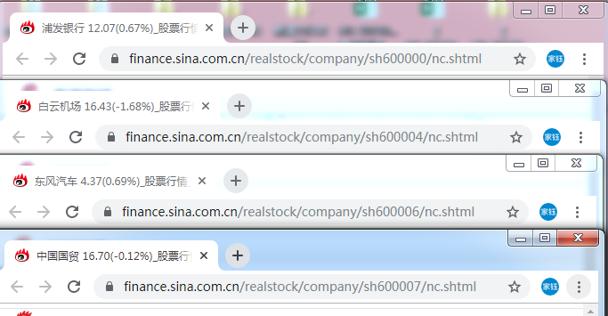

# 依据涨停 进行选股

## 更新

- 2019/10/25 </br>

  本地手动运行成功 </br>

- 2019/10/26 </br>

  双休日同样可以运行 爬下来的数据为周五下午三点收盘时的数据 </br>

- 2019/11/21 </br>

  服务器部署，定时运行代码</br>

  


## 简介

​		偶然得知，如果一只股票连涨两天的话，那么它在第三天有大概率是赚的。所以打算实现每天定时爬取新浪财经上的个股信息，并将连涨两天的股票通过邮件的形式通知自己。

### 需要的库

```python
#!/usr/bin/python
import os
import requests
import re
import time
import datetime
import pandas as pd
import smtplib
from email.mime.multipart import MIMEMultipart   # 构建邮件头信息
from email.mime.text import MIMEText    # 构建邮件正文
from email.header import Header    # 构建邮件标题
from email.utils import formataddr    # 格式化发件人地址
```

​		此代码仅供学习与交流。

## 思路

### 需要实现的功能

- [x] 从新浪财经 < http://vip.stock.finance.sina.com.cn/mkt/#hs_a > 获取数据
- [x] 从获得的数据中筛选出涨停的股票 并实现邮件通知
- [x] 服务器部署，定时运行代码
- [ ] 对连续涨停的股票持续关注，直到涨跌幅出现负值

### 获取网址

​		首先，打开链接，可以看到下图的界面，位于上方的红框内是关于每个页面显示的信息数量及页数信息，另一个红框内的信息包括股票的代码、名称、涨跌幅、买入、卖出等内容，也就是我们需要从网站上爬取的数据。</br>


​		点击翻页，URL 并没有随之发生明显的改变。


</br>

​		再打开 Chrome 浏览器的开发者工具 在 XHR 那里， 可以看到另一个 Request URL</br>

</br>

​		形如： 

> http://vip.stock.finance.sina.com.cn/quotes_service/api/json_v2.php/Market_Center.getHQNodeData?page=1&num=80&sort=symbol&asc=1&node=hs_a&symbol=&_s_r_a=auto 

​		从这个 Request URL 上，就能很轻易的推测出其中一些参数的内容。</br>

- page 显而易见，就是页数；

- num 也就是每页显示的信息条数；

- sort 和 asc 则代表信息按照第一列的代码进行升序排序；

- node 的值为 hs_a 也就是代表着沪深A股的意思。

- 至于最后的 _s_r_a 就不是很明白是什么意思了，但问题不大</br>

  在得到 URL 之后，就可以着手准备获取数据了。

  

### 解析网页&获取数据

先简单的爬取第一页数据，观察一下是否项目是所需要的数据。

```python
url = 'http://vip.stock.finance.sina.com.cn/quotes_service/api/json_v2.php/Market_Center.getHQNodeData?page=1&num=80&sort=symbol&asc=1&node=hs_a&symbol=&_s_r_a=page'
html = requests.get(url)
rawdata = html.text
print(type(rawdata))
print(rawdata)
```

可以看到输出的是一个长得像列表里嵌套多个字典的字符串，

```
<class 'str'>
[{symbol:"sh600000",code:"600000",name:"浦发银行",trade:"11.990",pricechange:"0.040",changepercent:"0.334",buy:"12.030",sell:"12.030",settlement:"11.990",open:"0.000",high:"0.000",low:"0.000",volume:0,amount:0,ticktime:"09:23:29",per:6.481,pb:0.733,mktcap:35193144.396003,nmc:33696412.914901,turnoverratio:0},
...
,{symbol:"sh600100",code:"600100",name:"同方股份",trade:"7.980",pricechange:"0.120",changepercent:"1.504",buy:"8.100",sell:"8.100",settlement:"7.980",open:"0.000",high:"0.000",low:"0.000",volume:0,amount:0,ticktime:"09:23:34",per:-6.096,pb:1.426,mktcap:2365191.362898,nmc:2365191.362898,turnoverratio:0}]
```

对获取的字符串进行处理，利用 replace( ) 函数去掉字符串中的花括号和双引号，再按照换行符 '\n' 切割字符串。

```python
rawdata = 
html.text[1:-1].replace(',{','\n').replace('{','').replace('}','').replace('"','')
data_list = rawdata.split('\n')
print(data_list[0])
```

输出结果如下：

```
symbol:sh600000,code:600000,name:浦发银行,trade:12.010,pricechange:0.020,changepercent:0.167,buy:12.010,sell:12.020,settlement:11.990,open:12.030,high:12.030,low:12.000,volume:825200,amount:9918180,ticktime:09:33:39,per:6.492,pb:0.734,mktcap:35251848.556797,nmc:33752620.442699,turnoverratio:0.00294
```

### 进一步处理数据

为了方便对数据的处理，将获取的股票信息，转化成 DataFrame 。利用正则提取出冒号前的内容，记作``` key_list``` ；循环遍历 ```data_list``` 列表提取出每支股票对应列名的值，添加到空列表```value_list``` 里。依据```key_list```  ，```value_list``` 构建 ```DataFrame``` 

```python
key_list = re.findall(r'([a-z]+):',data_list[0])
#print (key_list)
value_list = []
for i in range(len(data_list)):
    value_tup = re.findall(".*symbol:(.*),code:(.*),name:(.*),trade:(.*),pricechange:(.*),changepercent:(.*),buy:(.*),sell:(.*),settlement:(.*),open:(.*),high:(.*),low:(.*),volume:(.*),amount:(.*),ticktime:(.*),per:(.*),pb:(.*),mktcap:(.*),nmc:(.*),turnoverratio:(.*)",data_list[i])
    value_tmp = list(value_tup[0])
    value_list.append(value_tmp)
stock = pd.DataFrame(value_list,columns = key_list )
```

在 ```DataFrame``` 的基础上继续处理数据，

+ 原先的 ```ticktime``` 列是爬取数据时的时间，大部分都是15:00:00，为了方便后续的处理，我们用爬取数据时的日期替换；

  ```python
  day = str(time.strftime("%Y%m%d"))
  stock['ticktime'] = day + ' ' + stock['ticktime']
  ```

+ 爬取下来的数据是沪深股市的，我们因为只观察上证，所以筛选出上证的股票；

  从数据中可以观察到 ```symbol``` 列中上证的股票和深证股票有明显的差别，一个是 ```sh******``` 的形式，一个是```sz******``` 的形式

  ```python
  region = stock.symbol.astype(str).str[0:2]
  shanghai_stock = stock.loc[region == 'sh']
  ```

+ 因为是依据涨停，进行选股，所以将涨停的股票（涨跌幅 >= 10）筛选出来

  ```
  shanghai_stock['changepercent'] = pd.to_numeric(shanghai_stock['changepercent'])
  shanghai_limitup =shanghai_stock.loc[shanghai_stock['changepercent'] >= 10]
  ```

+ 考虑到可能需要点进详情页看详细信息，为每支股票添加详情页 url ，可以观察到股票详情页的 url 多为

  >  https://finance.sina.com.cn/realstock/company/{}/nc.shtml 

  而花括号中的内容则为每支股票的 ```symbol``` 列

  

```python
symbols = shanghai_limitup['symbol'].values
for i in symbols:
	stockurl = 'https://finance.sina.com.cn/realstock/company/{}/nc.shtml'
	shanghai_limitup.loc[shanghai_limitup['symbol'] == i ,'url'] = stockurl.format(i)
```


### 发送邮件


### 服务器部署

#### 1. 申请服务器

这个我也没啥研究，之前用过阿里云，这次也选择在阿里云开了个服务器，系统选择的是Centos7。

#### 2. 安装 Python3 及 运行所需的第三方库

系统自带的 Python 版本是2.7，需要手动安装 Python3，升级 pip。

这里我就不多赘述了，网上找一下攻略就成。

#### 3. 定时运行

使用 MobaXterm 远程连接到服务器，把 Python 文件上传至服务器。

Linux 中一般是由 crond 来周期性的执行指令列表。

crontab基本操作命令：

```
crontab -u  user # 指定用户的 crontab 服务，一般由 root 用户运行
crontab -l # 显示某用户的 crontab 文件，如果不指定用户则显示当前用户的 crontab 文件内容
crontab -e # 编辑某用户的 crontab 文件，如果不指定用户则编辑当前用户的 crontab 文件内容
crontab -r # 删除某用户的 crontab 文件，如果不指定用户则删除当前用户的 crontab 文件内容
crontab -i # 删除用户的 crontab 文件时，给与确认提示
```

这里直接使用 ```crontab -e``` 编辑当前 root 用户的 crontab 文件

```
[root@Aprsun ~]# crontab -e
30 15 * * * python3 /usr/local/stock/sina_finance.py > /usr/local/stock/log.log 2>&1
# 每天15点30分 执行 sina_finance 文件 并重定向日志到 log.log
```

命令语法如下：

```
# Example of job definition:
# .---------------- minute (0 - 59)
# |  .------------- hour (0 - 23)
# |  |  .---------- day of month (1 - 31)
# |  |  |  .------- month (1 - 12) OR jan,feb,mar,apr ...
# |  |  |  |  .---- day of week (0 - 6) (Sunday=0 or 7) OR sun,mon,tue,wed,thu,fri,sat
# |  |  |  |  |
# *  *  *  *  * user-name  command to be executed

# Special characters:
# * (星号) 代表任何时间，"* * * * *" 代表每分钟执行一次命令
# , (逗号) 代表不连续的时间，"15 1,3,5 * * *" 代表每天的1点15分，3点15分，5点15分都执行一次命令
# - (中杠) 代表连续的时间范围，"15 1 1-5 * *" 代表每个月的1号到5号的1点15分执行命令
# / (正斜线) 代表每个多久执行一次，"*/10 4 * * *" 代表在每天的4点，每隔10分钟执行一次命令 
```

运行 restart 命令，重启服务，使定时任务生效

```service crond restart```

#### *注：

* 在 crond 命令中需要使用绝对路径写到命令，否则运行会失败
* 执行过程中，也可以通过 ```tail -f /var/log/cron```  命令，查看 crontab 的执行情况
* 代码中需要读写文件时，文件路径也需要修改成绝对路径，否则文件会保存到根目录下